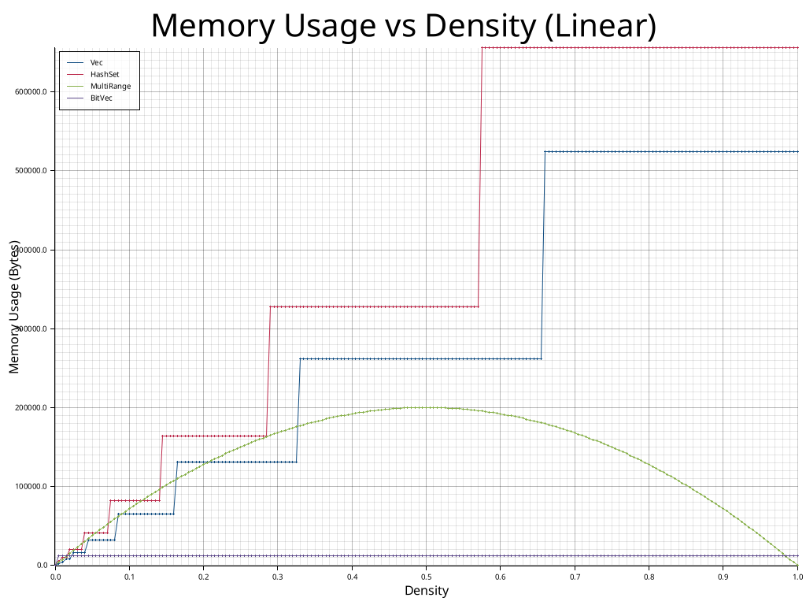
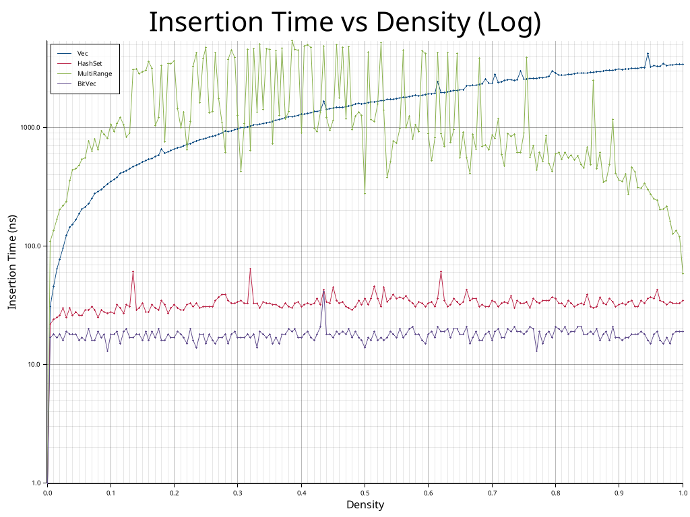
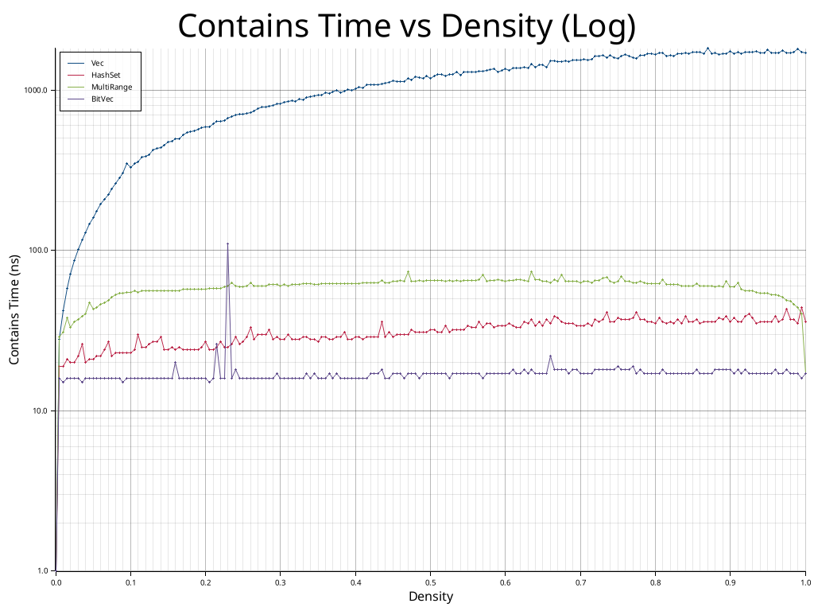

# Multi Ranged

[](https://github.com/earth-metabolome-initiative/multi_ranged/actions)
[](https://github.com/earth-metabolome-initiative/multi_ranged/actions)
[](https://opensource.org/licenses/MIT)
[](https://codecov.io/gh/earth-metabolome-initiative/multi_ranged)
[](https://crates.io/crates/multi_ranged)
[](https://docs.rs/multi_ranged)

Efficient data structures for representing and manipulating ranges of discrete values. The crate provides three range types with a unified [`MultiRanged`](https://docs.rs/multi_ranged/latest/multi_ranged/multi_ranged/trait.MultiRanged.html) trait: [`SimpleRange`](https://docs.rs/multi_ranged/latest/multi_ranged/structs/simple_range/struct.SimpleRange.html) for contiguous ranges similar to Rust's [`std::ops::Range`](https://doc.rust-lang.org/std/ops/struct.Range.html) but with stable semantics, [`BiRange`](https://docs.rs/multi_ranged/latest/multi_ranged/structs/birange/enum.BiRange.html) for ranges split into two parts, and [`MultiRange`](https://docs.rs/multi_ranged/latest/multi_ranged/structs/multi_range/struct.MultiRange.html) for arbitrary collections of disjoint ranges. All types support incremental insertion, merging, and efficient iteration over their elements. The [`Step`](https://docs.rs/multi_ranged/latest/multi_ranged/step/trait.Step.html) trait abstracts over numeric types that can be used as range boundaries, providing operations for stepping forward and backward with [saturating arithmetic](https://en.wikipedia.org/wiki/Saturation_arithmetic).

## Examples

### Simple Range

A contiguous range from start to end. See [`SimpleRange`](https://docs.rs/multi_ranged/latest/multi_ranged/structs/simple_range/struct.SimpleRange.html) for more details.

```rust
use multi_ranged::{SimpleRange, MultiRanged};

// Create a range [0, 10]
let mut range = SimpleRange::try_from((0, 10))?;
assert_eq!(range.len(), 11);
assert!(range.contains(5));
assert!(!range.contains(15));

// Extend the range to [0, 11]
range.insert(11)?;
assert_eq!(range.len(), 12);
# Ok::<(), multi_ranged::errors::Error<i32>>(())
```

### Bi Range

A range that can be split into at most two non-contiguous parts. See [`BiRange`](https://docs.rs/multi_ranged/latest/multi_ranged/structs/birange/enum.BiRange.html) for more details.

```rust
use multi_ranged::{BiRange, MultiRanged};

// Create a BiRange from a slice of integers.
// This creates two disjoint ranges: [1, 2] and [5, 6].
let mut range = BiRange::try_from([1, 2, 5, 6])?;
assert!(!range.is_dense());
assert_eq!(range.len(), 4);

// Insert a value that bridges the gap.
range.insert(3)?; // Now we have [1, 3] and [5, 6]
range.insert(4)?; // Now we have [1, 6]

assert!(range.is_dense());
assert_eq!(range.absolute_start(), Some(1));
assert_eq!(range.absolute_end(), Some(6));
# Ok::<(), multi_ranged::errors::Error<i32>>(())
```

### Multi Range

Multiple disjoint ranges that can be built incrementally. See [`MultiRange`](https://docs.rs/multi_ranged/latest/multi_ranged/structs/multi_range/struct.MultiRange.html) for more details.

```rust
use multi_ranged::{MultiRange, MultiRanged};

// Create a MultiRange from a slice of integers.
// This creates two disjoint ranges: [1, 3] and [10, 12].
let mut range = MultiRange::try_from([1, 2, 3, 10, 11, 12])?;
assert!(!range.is_dense());

// Insert values that bridge the gap between [1, 3] and [10, 12].
range.insert(4)?; // Now we have [1, 4] and [10, 12]
range.insert(5)?; // Now we have [1, 5] and [10, 12]
range.insert(6)?; // Now we have [1, 6] and [10, 12]
range.insert(7)?; // Now we have [1, 7] and [10, 12]
range.insert(8)?; // Now we have [1, 8] and [10, 12]
range.insert(9)?; // Now we have [1, 12]

// The ranges have merged into a single contiguous range: [1, 12].
assert!(range.is_dense());
assert_eq!(range.absolute_start(), Some(1));
assert_eq!(range.absolute_end(), Some(12));
# Ok::<(), multi_ranged::errors::Error<i32>>(())
```

## Trait Overview

The [`MultiRanged`](https://docs.rs/multi_ranged/latest/multi_ranged/multi_ranged/trait.MultiRanged.html) trait provides a common interface for all range types with methods for insertion, merging, containment checking, and iteration. The [`Step`](https://docs.rs/multi_ranged/latest/multi_ranged/step/trait.Step.html) trait enables generic range operations over any numeric type supporting saturating arithmetic and ordering.

## Benchmarks

We compared the memory usage and execution time of `Vec<i32>`, `HashSet<i32>`, `MultiRange`, and `BitVec` (from the `sux` crate) across different densities of data within a fixed range [0, 100,000).

To run the benchmark:

```bash
cargo run --release --example memory_benchmark
```

### Memory Usage

**Note:** `MultiRange` shows higher standard deviation in memory usage because its capacity adapts to the number of disjoint ranges (fragmentation), which varies significantly with random input distribution at specific densities. `shrink_to_fit` is used to minimize footprint, reflecting this structural variance.

| Density | Vec (Bytes)      | HashSet (Bytes)  | MultiRange (Bytes) | BitVec (Bytes)  |
|---------|------------------|------------------|--------------------|-----------------|
| 0.1000  | 65560.00 ± 0.00  | 81968.00 ± 0.00  | 71989.60 ± 69.10   | 12536.00 ± 0.00 |
| 0.5000  | 262168.00 ± 0.00 | 327728.00 ± 0.00 | 200239.20 ± 534.99 | 12536.00 ± 0.00 |
| 0.9000  | 524312.00 ± 0.00 | 655408.00 ± 0.00 | 72053.60 ± 222.34  | 12536.00 ± 0.00 |
| 0.9500  | 524312.00 ± 0.00 | 655408.00 ± 0.00 | 38033.60 ± 86.15   | 12536.00 ± 0.00 |
| 0.9900  | 524312.00 ± 0.00 | 655408.00 ± 0.00 | 7961.60 ± 26.73    | 12536.00 ± 0.00 |



As shown in the table:

- **BitVec** is the most compact data structure, but it requires the range bounds to be known in advance.
- **MultiRange** memory layout optimizes for high densities, outperforming `Vec` and `HashSet` when the density is > 0.9. It is effective for nearly contiguous data where the number of stored ranges is small.

### Insertion Time

| Density | Vec (ns)         | HashSet (ns) | MultiRange (ns)  | BitVec (ns)  |
|---------|------------------|--------------|------------------|--------------|
| 0.1000  | 354.40 ± 38.85   | 28.00 ± 4.00 | 1066.70 ± 109.79 | 18.00 ± 4.00 |
| 0.5000  | 1600.50 ± 201.47 | 36.10 ± 4.99 | 277.30 ± 310.36  | 14.00 ± 4.90 |
| 0.9000  | 3122.70 ± 333.52 | 32.10 ± 3.96 | 362.40 ± 249.51  | 17.00 ± 6.40 |
| 0.9500  | 3261.70 ± 300.13 | 37.00 ± 6.40 | 275.60 ± 93.65   | 15.00 ± 5.00 |
| 0.9900  | 3422.10 ± 276.47 | 33.10 ± 4.53 | 135.20 ± 16.53   | 19.10 ± 3.05 |



- **Vec** insertion time grows linearly because it requires checking for duplicates (O(N)).
- **HashSet** and **BitVec** offer constant time insertion.
- **MultiRange** insertion improves at higher densities as gaps are filled and ranges merge, reducing the number of disjoint ranges to manage.

### Contains Time

| Density | Vec (ns)         | HashSet (ns) | MultiRange (ns) | BitVec (ns)  |
|---------|------------------|--------------|-----------------|--------------|
| 0.1000  | 329.10 ± 39.40   | 23.80 ± 1.17 | 55.20 ± 2.71    | 16.00 ± 0.63 |
| 0.5000  | 1181.00 ± 142.59 | 32.70 ± 3.41 | 65.90 ± 3.78    | 17.30 ± 1.49 |
| 0.9000  | 1732.00 ± 194.63 | 36.20 ± 2.18 | 59.70 ± 3.07    | 18.00 ± 1.18 |
| 0.9500  | 1772.00 ± 189.71 | 36.60 ± 2.62 | 54.30 ± 1.79    | 17.80 ± 1.89 |
| 0.9900  | 1793.80 ± 142.24 | 35.70 ± 1.35 | 44.40 ± 2.94    | 17.30 ± 1.10 |



- **Vec** lookup is O(N).
- **MultiRange** utilizes binary search on the disjoint ranges, resulting in O(log M) complexity (where M is number of ranges). Performance remains stable across the tested densities.
- **HashSet** and **BitVec** provide O(1) lookups.
